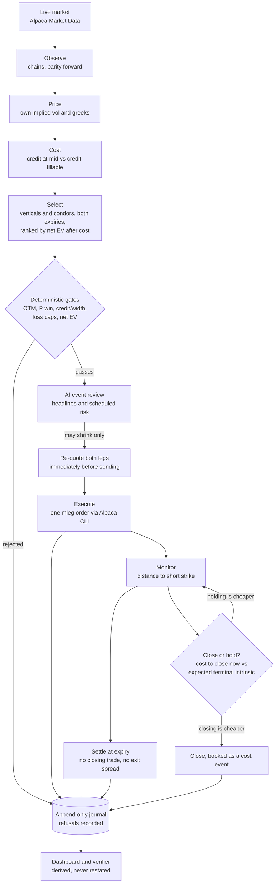
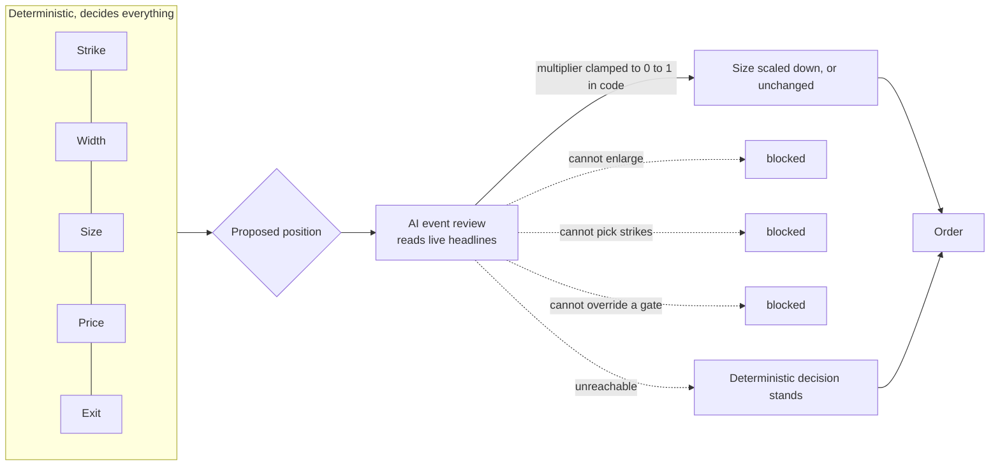

# HALFSPREAD

**Every options agent knows how to enter a trade. Almost none price what it will cost to get out.**

HALFSPREAD is an autonomous options agent that measures execution cost before every order, ranks
structures by expected value *after* that cost, and then declines to pay it twice by settling
instead of closing.

| | |
|---|---|
| Live dashboard | **https://ahammadshawki8.github.io/halfspread/** |
| Alpaca paper account under judging | `0509a308-f1ef-44e2-8e8b-8a6d0893f84b` |
| Reproduce every claim | `python -m agent.verify` |

---

## The finding

A profitable signal can still be an unprofitable trade. In short-dated options the bid-ask is not
a rounding detail, it is the dominant term, and it is worst exactly where a delta screen sends you.

<!-- BEGIN:MEASURED -->
<!-- generated by `python -m agent.publish`; do not edit by hand -->

**Measured at 2026-09-04T18:41:02+00:00.** Every figure below is generated from the
append-only journal in this repository, not typed in, and carries the moment it was
taken. Reproduce all of it with `python -m agent.verify` (no key, no account, no network),
or read the current numbers on the [live dashboard](https://ahammadshawki8.github.io/halfspread/).

| | |
|---|---|
| Cost to cross at the money, SPY | 2.22% of mid |
| Cost to cross 2 to 3 points out | 14.29% of mid  (6.4x worse) |
| Same contract, open against latest | 9.67x more expensive to cross  (SPY 762 put) |
| Largest decision-to-execution drift | $7.00 per contract |
| Credit received | $132.00 |
| Entry cost paid | $22.00 |
| Exit cost paid | $0.00 |
| Exit cost still at stake, open positions | $8.00 |
| Account | $50.92 against a $100,000 start |
| Candidates priced / admitted | 46,075 / 1,056 |
| Decisions not to trade | 42 |
| Sessions behind the breach distribution | 668 since 2024-01-02 |
| Claims reproducing from the journal | 10/10 |

<!-- END:MEASURED -->

Two consequences the agent is built around.

**The textbook strike is the expensive one.** "Sell the 15 to 20 delta" lands where relative cost
peaks. Strike selection here maximises net expected value after measured cost, so it does not go
where a delta screen would send it.

**The exit costs multiples of the entry, and it is optional.** An out-of-the-money contract that
simply expires costs nothing to leave: no closing trade, no spread, and Alpaca charges no
commission. So the agent trades only defined-risk structures it intends to hold to settlement.

There is a third finding it did not want. **The edge is thin.** Admitted candidates need breakeven
win rates in the high eighties to high nineties against modelled win probabilities in the seventies
to low nineties. That is Vilkov's 2026 result reproducing in live quotes, and it is why this desk is
sized to survive rather than to produce a headline.

## How it differs

| Most trading agents | HALFSPREAD |
|---|---|
| Optimise the signal | Optimise the trade economics |
| Price at mid | Price at what you can actually fill |
| Exit on a trigger or a stop | Exit on arithmetic, or not at all |
| Lognormal risk model | Model **and** measured sessions, worse of the two |
| The model decides | The model may only shrink; code decides |
| Log the fills | Log every refusal and every correction |

## Architecture



The language model occupies exactly one node, and its authority runs one way.



We do not trust a language model with money. We give it the one job humans are worst at
automating: reading unstructured event risk off the wire. It can make a position smaller and it
can do nothing else, and the clamp is enforced in code rather than requested in a prompt.

## Use it

**[Price a trade yourself](https://ahammadshawki8.github.io/halfspread/#try)** on the live page.
Pick a strike and a width against the chain the desk is trading right now, and the same engine that
decides its orders runs in your browser: credit at mid against credit you can actually fill, what
crossing in costs, what leaving would cost at this moment, win probability from both the model and
the measured sessions, and every gate with the arithmetic that passed or failed it. "Find the best
one" ranks every combination the chain supports.

Most combinations are rejected. That is the point of it. The engine is useful precisely because it
says no, and you can watch it say no to a trade you chose rather than one it chose.

`docs/engine.js` is a direct port of `pricing.py`, `cost.py` and the risk gates, so anything the
page computes can be reproduced by running the Python.

## Point it at your own account

The desk speaks MCP, so you can ask it questions in plain English from Claude Desktop, Claude Code
or Cursor, against your own Alpaca paper account. Your keys stay on your machine.

```bash
git clone https://github.com/ahammadshawki8/halfspread && cd halfspread
export ALPACA_COMP_API_KEY=...  ALPACA_COMP_SECRET_KEY=...

claude mcp add halfspread -- python -m agent.mcp_readonly     # Claude Code
```

Cursor and Claude Desktop read the same shape from `.mcp.json`, which ships in the repository:

```json
{
  "mcpServers": {
    "halfspread": {
      "command": "python",
      "args": ["-m", "agent.mcp_readonly"],
      "env": {
        "ALPACA_API_KEY": "${ALPACA_COMP_API_KEY}",
        "ALPACA_SECRET_KEY": "${ALPACA_COMP_SECRET_KEY}",
        "ALPACA_PAPER_TRADE": "true"
      }
    }
  }
}
```

Then ask it something: *"What is open on my paper account, and what would it cost me to close it
right now?"*

Read-only is enforced rather than promised. Alpaca's own toolset filter does not remove the
order-placing tools, because they are built-in overrides rather than spec-driven operations, so
`agent/mcp_readonly.py` sits in front and strips every mutating tool from `tools/list` and refuses a
call to one by name. See exactly what it blocks:

```bash
python -m agent.mcp_readonly --audit
```

```
upstream server exposes 35 tools
BLOCKED by the proxy (11): place_stock_order, place_crypto_order, place_option_order,
  cancel_order_by_id, cancel_all_orders, close_position, close_all_positions,
  replace_order_by_id, update_account_config, exercise_options_position,
  do_not_exercise_options_position
allowed through (24): account, positions, orders, chains, snapshots, news, docs
```

Nothing needs connecting to try the analysis, though: `python -m agent.scan --curve` prices the
whole chain read-only, and the section below needs no keys at all.

## Verify it

No API key, no account, no network:

```bash
git clone https://github.com/ahammadshawki8/halfspread && cd halfspread
python -m agent.verify
```

Ten claims, each re-derived from the committed append-only journal, exiting non-zero if any fails
to reproduce. It runs in CI on every push, next to 39 unit tests.

Trading projects have a credibility problem: anyone can screenshot a P&L. The journal records
refusals with the same weight as fills, and when the ledger once showed P&L that had not happened,
the bug, the removal and the reasoning were written into the journal as a correction record rather
than quietly deleted.

## What it is built on

Four results shape the design. Two of them argue against trading at all, which is why the desk is
sized the way it is.

| | |
|---|---|
| **Vilkov (2026)**, *0DTE Trading Rules: Tail Risk, Implementation, and Tactical Timing* | An August 2026 correction reversed every net-of-cost conclusion: the bid-ask half-spread had been charged at one hundredth of its true size, and iron condors moved from -0.96 to -2.67 net Sharpe. The reason this desk treats execution cost as a first-order term. SSRN 4641356 |
| **Yao and Zheng (2026)**, *Beyond Agent Architecture* | Audits thirty studies and finds execution semantics and cost treatment are the least reported dimensions in the literature. The verifier answers that audit directly. arXiv:2606.08285 |
| **The Alpha Illusion (2026)** | Reported returns from language-model agents do not survive deployment. Hence publishing refusals and corrections alongside fills. arXiv:2605.16895 |
| **Profit Mirage (2025)** | Backtested performance collapses out of sample because models recall outcomes rather than learn causes. Nothing here is fitted: the breach distribution is counted from measured sessions and the model is handed no parameter to tune. arXiv:2510.07920 |

## Built on Alpaca

- **Trading API** for multi-leg orders, two-leg verticals and four-leg iron condors, every leg
  covered inside one order for level three.
- **Alpaca CLI** as the agent's hands. Each broker action is an invocation recorded verbatim in the
  journal and replayable by hand.
- **MCP server** as the window onto the desk, behind a proxy that *enforces* read-only. Alpaca's
  toolset filter does not remove the order-placing tools, so `agent/mcp_readonly.py` strips every
  mutating tool from `tools/list` and refuses a call to one by name: 11 of 35 blocked, 24 reads
  allowed. Audit it with `python -m agent.mcp_readonly --audit`.
- **Market Data API** for chains, snapshots, news, and the intraday bar history behind the measured
  breach distribution.

Options quotes come from Alpaca's **indicative** feed, not OPRA. Every cost figure here is the cost
this account was actually charged on that feed, which is also the feed paper fills are simulated
against, so the accounting is internally consistent. It is not a claim about the OPRA market spread,
and where that distinction matters this project says so rather than rounding it away.

## Run it

```bash
pip install -r requirements.txt   # standard library only; this is a no-op
cp .env.example .env              # add your Alpaca paper keys

python -m agent.scan --curve      # read-only: price every candidate, no orders
python -m agent.empirical --report  # the measured intraday distribution
python -m agent.run --once        # one full decision cycle, dry run
python -m agent.session --minutes 60   # observer, agent and monitor together
python -m agent.verify            # re-derive every published claim
python -m agent.publish           # regenerate the dashboard and this README's figures
```

The competition account is refused by `agent/execute.py` unless an explicit arming token is passed
at the call site, so it cannot be traded by accident.

## Layout

```
agent/
  config.py      thresholds, universe, account routing
  cli.py         Alpaca CLI wrapper; every invocation journalled
  pricing.py     Black-Scholes, implied-vol solve, greeks
  empirical.py   measured intraday move distribution
  chain.py       OCC parsing, chain retrieval, put-call-parity forward
  cost.py        entry cost, exit cost, net EV, admissibility gates
  condor.py      four-leg iron condors, scored onto the same ranking
  risk.py        sizing, per-position and per-day loss caps
  llm.py         bounded event review; clamped to shrink-only
  execute.py     mleg construction, re-quote, submission, fill confirmation
  monitor.py     pin-risk watch, net-of-cost close decision
  settle.py      settlement accounting and the counterfactual
  session.py     one session: observer, agent and monitor together
  publish.py     derives the dashboard payload and this README's figures
  verify.py      re-derives published claims from the journal
  mcp_readonly.py  read-only enforcement proxy for the MCP window
docs/            the dashboard and the in-browser decision engine
data/journal/    append-only decision record
data/empirical/  cached intraday distribution
```

Runs unattended on GitHub Actions (`.github/workflows/session.yml`), which commits its own journal
back, so the audit trail is timestamped by git rather than by the agent. No server, no cost.

---

Paper trading is a simulation. Hypothetical results do not represent actual trading and do not
guarantee future results. Options carry substantial risk and are not suitable for every investor;
see [Characteristics and Risks of Standardized Options](https://www.theocc.com/company-information/documents-and-archives/options-disclosure-document).
Nothing here is investment advice.

MIT licensed.
